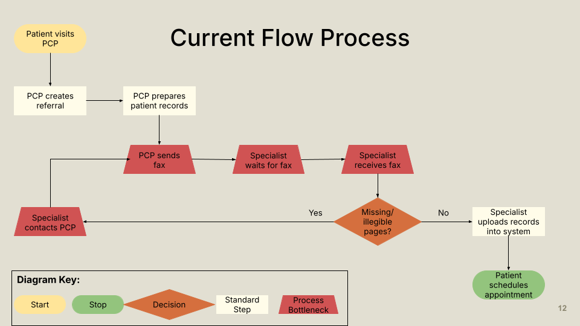
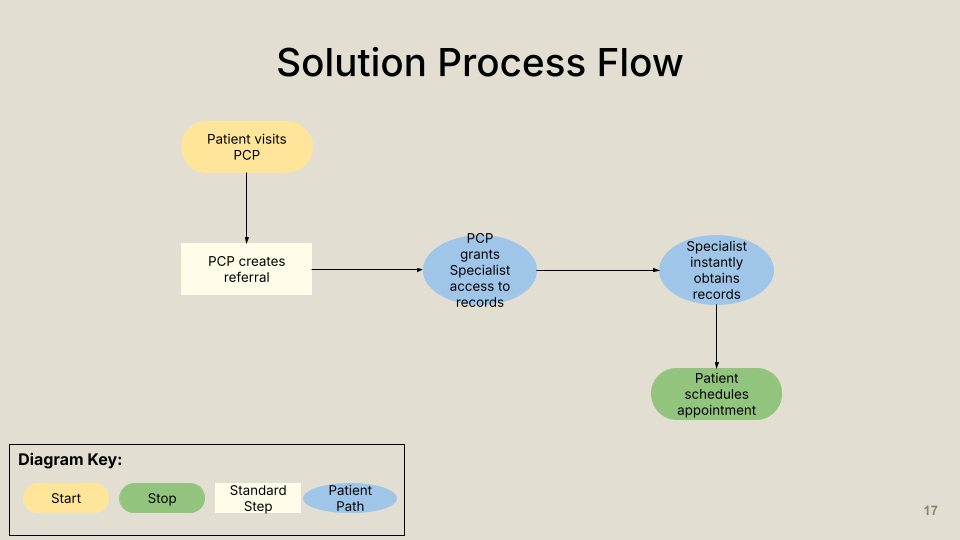
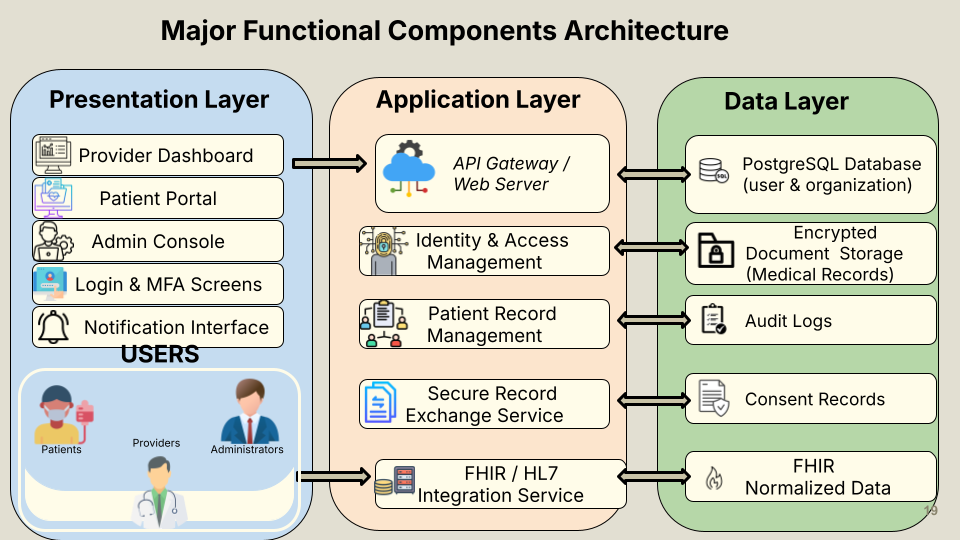
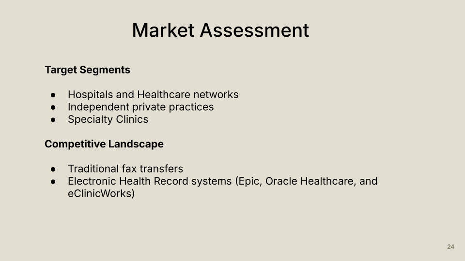
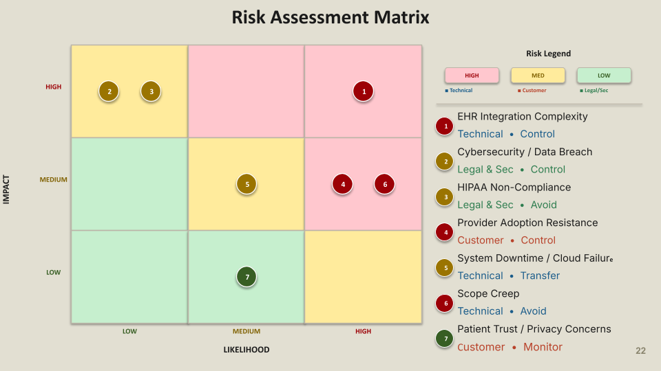

# Project Deliverables

This section presents the key artifacts created during the PatientPath feasibility study.  
These diagrams and analyses illustrate the current healthcare communication challenges and demonstrate how the PatientPath system is designed to address those issues.

Each deliverable provides a visual representation of a different aspect of the system design, workflow improvement, or project risk analysis.

---

## Current Process Flow

The current healthcare record transfer process often relies on manual coordination and fax-based communication between providers.  
This process can result in delayed information exchange, missing documents, and additional administrative work for healthcare staff.

The diagram below illustrates the typical workflow involved in transferring patient records between a primary care provider and a specialist.

---

## Solution Process Flow

PatientPath replaces fax-based communication with a secure digital platform that allows providers to share and access medical records instantly.

The solution workflow demonstrates how PatientPath simplifies the referral process by enabling providers to securely grant access to patient records and track document transfers in real time.

---

## Major Functional Components Diagram (MFCD)

The Major Functional Components Diagram (MFCD) illustrates the architectural structure of the PatientPath system.

This diagram highlights the major system layers, including:

- Presentation Layer (user interfaces such as provider dashboards and patient portals)
- Application Layer (core services such as record management and authentication)
- Data Layer (secure storage of medical records, audit logs, and system data)

Together, these components form the core architecture required to support secure medical document exchange.

---

## Competition Matrix

The competition matrix compares PatientPath with existing healthcare communication approaches such as fax-based record transfer and traditional electronic health record (EHR) systems.

This comparison highlights how PatientPath focuses specifically on secure interoperability and cross-organization communication, addressing gaps that exist in many current solutions.

---

## Risk Assessment Matrix

The risk matrix identifies potential project risks and evaluates them based on two factors:

- Likelihood of occurrence
- Potential impact on the project

This analysis helps the team identify which risks require mitigation strategies and ensures that technical, legal, and customer-related concerns are considered during the development process.

