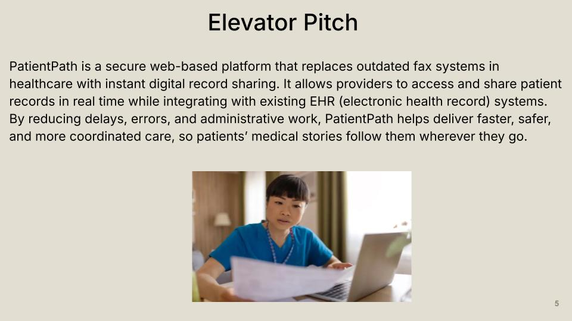

# PatientPath Presentations

This section contains the PatientPath elevator pitch along with all Feasibility and Design presentation iterations developed over the course of the project.

---

## Elevator Pitch

The slide below summarizes the core idea behind PatientPath and the value it provides to healthcare providers and patients.

---

## Feasibility Presentations

The feasibility presentations document the early analysis of the problem space, proposed solution, market context, risks, and project feasibility.

### Feasibility — Version 1

The first feasibility iteration establishes the initial problem framing, solution concept, and high-level feasibility analysis for PatientPath.

<!--
To embed the Google Slides version:
  1. In Google Slides: File → Share → Publish to web → Embed tab
  2. Copy the URL from inside src="..." (it will look like:
     https://docs.google.com/presentation/d/e/XXXXXXX/pubembed?start=false&loop=false&delayms=3000)
  3. Paste it into the iframe src below, replacing PASTE_FEASIBILITY_V1_EMBED_URL_HERE
-->

<iframe src="https://docs.google.com/presentation/d/e/2PACX-1vSnzFveXBWOte_nMiBKtEffyIFOos1UBShOAH3d1DO86008mi_rgP_PbM7n7-7NIQ/pubembed?start=false&loop=false&delayms=3000"
style="position:absolute; top:0; left:0; width:100%; height:100%;"
frameborder="0"
allowfullscreen="true"
mozallowfullscreen="true"
webkitallowfullscreen="true"></iframe>

  <a href="{{ '/assets/docs/Feasibility_V1_Group_Orange.pdf' | relative_url }}"
     style="display:inline-block; text-decoration:none; border:1px solid #0f766e; background:#0f766e; color:#ffffff; padding:10px 16px; border-radius:999px; font-weight:600;">
    Download Feasibility V1 (PDF)
  </a>

---

### Feasibility — Version 2

The second feasibility iteration refines the analysis based on teacher and class feedback, including updated risk color-coding and tightened problem–solution alignment.

<!-- Paste the Feasibility V2 Google Slides embed URL into the iframe src below. -->

<iframe src="https://docs.google.com/presentation/d/e/2PACX-1vQ8vv9Qe4uZXXl6VxSxP-awZlvDuNKO346tkjKdGjKFPtAsqCB7XdOYaA-h1Ewzqg/pubembed?start=false&loop=false&delayms=3000"
style="position:absolute; top:0; left:0; width:100%; height:100%;"
frameborder="0"
allowfullscreen="true"
mozallowfullscreen="true"
webkitallowfullscreen="true"></iframe>

  <a href="{{ '/assets/docs/Feasibility_V2_Group_Orange.pdf' | relative_url }}"
     style="display:inline-block; text-decoration:none; border:1px solid #0f766e; background:#0f766e; color:#ffffff; padding:10px 16px; border-radius:999px; font-weight:600;">
    Download Feasibility V2 (PDF)
  </a>

---

## Design Presentations

The design presentations build on the feasibility work to define the technical architecture, user stories, feature table, user roles, database schema, algorithms, and sprint plan for PatientPath.

### Design — Version 1

The first design iteration introduces the core system architecture, user stories, feature table, and supporting design components for PatientPath.

<!-- Paste the Design V1 Google Slides embed URL into the iframe src below. -->

<iframe src="https://docs.google.com/presentation/d/e/2PACX-1vQ1gc6oaYrVNbn7iLZDUhPjSTrSolm4D4lWxvJal88PKOOFGQZ5czjOq_zYVLzhUw/pubembed?start=false&loop=false&delayms=3000"
style="position:absolute; top:0; left:0; width:100%; height:100%;"
frameborder="0"
allowfullscreen="true"
mozallowfullscreen="true"
webkitallowfullscreen="true"></iframe>

  <a href="{{ '/assets/docs/Design_V1_Group_Orange.pdf' | relative_url }}"
     style="display:inline-block; text-decoration:none; border:1px solid #0f766e; background:#0f766e; color:#ffffff; padding:10px 16px; border-radius:999px; font-weight:600;">
    Download Design V1 (PDF)
  </a>

---

### Design — Version 2

The second design iteration expands the technical depth of the system with refined user stories, a split feature table, external interface APIs, development tools and dependencies, and a complete sprint plan.

<!-- Paste the Design V2 Google Slides embed URL into the iframe src below. -->

<iframe src="https://docs.google.com/presentation/d/e/2PACX-1vRNHZP7cw4eduwa54xgy33NUCOe9df4GaOFnxSpyOI0tg5w-gj_KabBelv-B0R0BQ/pubembed?start=false&loop=false&delayms=3000"
style="position:absolute; top:0; left:0; width:100%; height:100%;"
frameborder="0"
allowfullscreen="true"
mozallowfullscreen="true"
webkitallowfullscreen="true"></iframe>

  <a href="{{ '/assets/docs/Design_V2_Group_Orange.pdf' | relative_url }}"
     style="display:inline-block; text-decoration:none; border:1px solid #0f766e; background:#0f766e; color:#ffffff; padding:10px 16px; border-radius:999px; font-weight:600;">
    Download Design V2 (PDF)
  </a>

