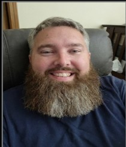

# Team

PatientPath is developed by a multidisciplinary team focused on improving secure, reliable medical document exchange.

  

    
    <h3 class="team-name">Kaitlyn Molaison</h3>
    
Role: Project Manager

    

      Kaitlyn is the project manager of PatientPath, contributing to design, development, and documentation while helping guide the team’s overall vision and progress.
    

  

  

    
    <h3 class="team-name">Stephen Garrison</h3>
    
Role: Software Developer

    

      Stephen Garrison is a team member on PatientPath who contributes to system design, technical writing, and building clear project communication through the team website.
    

  

  

    
    <h3 class="team-name">Emily Nowak</h3>
    
Role: Documentation Specialist

    

      Emily is a PatientPath team member responsible for documentation and creating process flow diagrams to clearly communicate system design and project goals.
    

  

  

    
    <h3 class="team-name">Grace Wright</h3>
    
Front End Developer: ____

    

      Grace is a PatientPath team member responsible for the front end development. She will contribute to the front end design of the website, and ensure that it is working properly for user's. 
    

  

  

    
    <h3 class="team-name">James Woodson</h3>
    
Role: Software Developer

    

      James is a PatienPath team member who contributes to software design implementation as well as other backend tasks.
    

  

  

    
    <h3 class="team-name">Christopher DeHaven</h3>
    
Role: Software Developer

    

      Christopher is a developer for PatientPath who contributes to software design implementation and improving functionality and efficiency within the system.
    

  

  

    
    <h3 class="team-name">Darnell Barnes</h3>
    
Role: Full Stack Developer

    

      Darnell is a PatientPath team member who contributes to the frontend user interface and backend system functionality.
    

  

